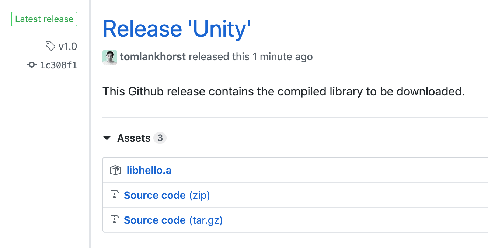

Download a pre-built library from Github release with CMake
=====

An experimental approach to reduce build times by downloading pre-built libraries instead of compiling them. 

- The executable described by `main.cpp` needs to link to a library `libhello`
- `libhello`'s source and include files are in the repo
- CMake will try to download pre-compiled `libhello.a` before attempting to build the library itself
- If the download is successful, it will be used as an imported `libhello`

----

_GitHub Release v1.0_